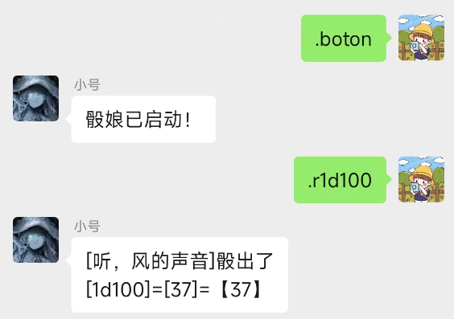

# TODO
1、导出QQ的骰娘指令
2、群组名字获取

# 微信版骰子机器人
一个基于[WeChatFerry](https://github.com/lich0821/WeChatFerry)的微信机器人。
参考[WeChatRobot](https://github.com/lich0821/WeChatRobot)。

可用于在微信聊天中掷骰子，主要适用于标准COC7版规则下的TRPG，其他规则可能待补充。

如果只用基础投掷功能，也可用于其他TRPG。

在线创建角色卡、管理角色卡，KP可在后台查看所有角色卡。减少玩家手机端车卡的不便。

## 环境
因为是基于Windows下微信客户端HOOK方式的机器人，所以只能运行在windows环境下，想要部署在linux环境下同学得另寻他路了。

## 使用说明
### 可选1
1. 安装微信 `3.9.2.23`，下载地址在 [这里](https://github.com/lich0821/WeChatFerry/releases/latest)；也可以从 [WeChatSetup](https://gitee.com/lch0821/WeChatSetup) 找到。
2. 下载dist/目录下的main.exe文件，也可在此[直接下载打包好的exe文件](https://github.com/libin47/WeChatRobot_TRPG_COC/releases/download/exe/main.exe)，在启动微信后直接运行即可（未测试，应该是需windows10+系统）


### 可选2
如果想要对程序进行修改完善，可按照以下说明开始：
1. 安装微信 `3.9.2.23`，下载地址在 [这里](https://github.com/lich0821/WeChatFerry/releases/latest)；也可以从 [WeChatSetup](https://gitee.com/lch0821/WeChatSetup) 找到。
2. 克隆项目，安装环境，需要python>=3.9
3. 登录微信后，运行main.py即可
4. 编译成exe文件方便部署
```shell
pyinstaller -F --add-data "config.yaml;." --add-data "C:\...\Python39\site-packages\wcferry\*;.\wcferry"  main.py 
```
```shell
pyinstaller -F --add-data "config.yaml;." --add-data "config.yaml.template;." --add-data "C:\Users\Bilin\AppData\Roaming\Python\Python39\site-packages\wcferry\*;.\wcferry"  main.py

```

## 目前实现功能
未特别说明的功能仅限群聊可用。



### 
```shell
【群组中】
.boton 启动骰娘
.botoff 关闭骰娘
.start 游戏启动
.pause 游戏暂停
.end 游戏结束
.log 获取日志
.jrrp 今日人品
每日一卦 抽一卦
塔罗 塔罗牌来一卦
.pc 获取PC角色卡面板地址
.admin 获取KP管理面板地址
.r[表达式] 投骰
.ra[次数#][属性/技能] 进行属性和技能检定
.rc[次数#][属性/技能][目标值] 进行属性和技能检定，指定目标检定
（以上三个可在r或a/c后接h以使用暗骰）
.st[hp/mp/san][+-][变动值] 数值变更
.show[查询内容] 查询角色信息
.find[查询内容] 查询角色信息 同上
.dex[姓名80(敏捷数值)] 敏捷排序
.en 成长检定
.sc[成功值]/[失败值] 理智检定
.ti 生成临时疯狂症状
.li 生成总结疯狂症状
.mark[线索组名称] 只有引用其他文本时有效，将此内容标记为线索
.markshow[线索组名称] 获取储存的线索组内容
.flash 刷新群组设置
.group [gd[购点数量]] [time[随机次数]] [s[大成功点数]] [f[大失败点数]] 房规设置
.help 帮助
以上指令可通过@群里其他成员进行代骰。
【使用帮助-个人】
.jrrp 今日人品
每日一卦 抽一卦
.pc 打开角色管理面板
.r[表达式] 投骰
.help 帮助
塔罗 塔罗牌来一卦
```
#### .r\[投掷表达式]([投掷原因])
[投掷表达式] = ([掷骰次数]#)[骰子个数]d[骰子面数] (b[奖励骰个数])(p[惩罚骰个数])  
私聊可用
- `.r1d100+10`
- `.r1d100b2`
- `.r1d100p2`
- `.r1d6+2 砍刀伤害`    
- `.r3#1d100`
- `.r沙漠之鹰`    录入存在角色卡时，可调用角色卡中保存武器的表达式
- `.r3d6*5`     乘号不能用x
#### .st [表达式]
修改或操作角色各项属性,例如:
- `.st hp-2` 可修改HP/MP/SAN值
- `.st san-1d6` 支持投掷表达式
- `.st 幸运 55` 属性支持直接赋值或加减
- `.st 意志+10`
- `.st 侦查+20` 技能只能+-，以改动成长值，不能直接赋值
- `.st &武器=1d6+10` 设置武器快捷投掷伤害
#### .ra 属性/技能
进行属性或技能检定，支持多个：
- `.ra力量`
- `.ra3#力量`
- `.ra3#b1力量`
- `.ra3#b1力量 60`
#### .rc 
同ra
#### .find ([项])
查看当前角色指定项目的值，如果不指定则查看全部。例如：
- `.find 力量`
- `.find 属性`
- `.find 会计`
- `.find 技能`
- `.find 随身物品`
- `.find 武器`
- `.find 沙漠之鹰`
- `.find`
#### .en
进行成长检定，所有记录过成功的技能将会进行成长检定，如果超过90自动获取理智恢复

## 说明
每日一卦和塔罗需要把data/文件夹放在main.exe同级目录下。